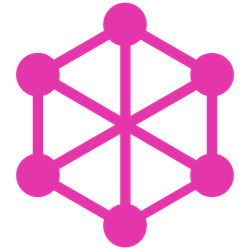
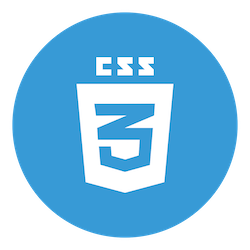

# Fullerstack 

## Powered By

## Supported Platforms

- Browsers (Angular)
- Desktop (Electron)
- Mobile (NativeScript, Ionic)

## Legends

### Libraries

- AG = Agnostic (not target specific)
- NG = [Angular](angular.io)
  - NGAG = Platform Agnostic Angular
  - NGAGX = Platform Agnostic Angular Extension (library)
- NT = [Nest](nestjs.com)
  - NTAG = Platform Agnostic Nest
  - NTAGX = Platform Agnostic Nest Extension (library)
- WB = Web (Chrome, Firefox, Safari, Edge, etc)
- EL = [Electron] (electronjs.org)
- NS = ]NativeScript] (nativescript.org)
- AN = Google's [Android] (android.com)
- IC = ]Ionic] (ionicframework.com)

### Applications

- wb.appname = Web (Chrome, Firefox, Safari, Edge, etc)
- el.appname = Desktop (Electorn Application - Linux, MacOS, Windows)
- ns.appname = NativeScript (Andriod, iOS)
- ic.appname = Ionic (Andriod, iOS)

# Description

This project is a mono-repo for FullerStack which is an open source dashboard powered by Angular for the frontend and NetJs for the backend.

#### The mono-repo was created via Nrwl/Nx.

npx create-nx-workspace fullerstack

#### Instruction (for developers)

git clone https://github.com/neekware/fullerstack.git && cd fullerstack && npm install

#### Graph dependencies

npm run dep-graph

#### Webpack analyzer

nx build fullerstack --stats-json --prod && npm run stats

#### Graph dependencies uncommitted changes from affected libs/apps

npm run affected -- --target dep-graph --uncommitted

#### Graph dependencies changes from affected libs/apps on main

npm run affected -- --target dep-graph --base=main

#### Test uncommitted changes from affected libs/apps

npm run affected -- --target test --uncommitted

#### Test committed changes on main

npm run affected -- --target test --base=main

#### Format changed files

npm run format

# Sponsors

This project was generated using [Nx](https://nx.dev).
