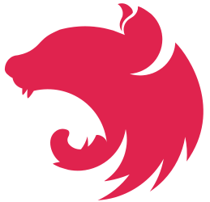

# Fullerstack 

[![status-image]][status-link]
[![coverage-image]][coverage-link]

## Description

This project is a mono-repo for FullerStack which is an open source dashboard powered by Angular for the frontend and NetJs for the backend.

## Mission

To create an open source dashboard similar to [avidtrader.co](https://app.avidtrader.co/)

- Quality of Experience and Security First
- Geo Location Support
  - Geo Fencing
  - IP address filtering
- Translations
  - Internationalization (i18n
  - Localization (i10n)
  - Left2Right, Right2Left Support
- GraphQL
  - Frontend & Backend
- PubSub
  - RxJS (Subscription, Push)
- Built-in Auth & Auth (Authentication & Authorization)
  - Powered by JWT (Auth & Access)
  - Fully Stateless
- Full SQL Support
  - PostgresQL as 1st class citizen
- Dark Mode Support
- ...Etc

### The mono-repo was created via Nrwl/Nx.

npx create-nx-workspace fullerstack

### Powered By

[](https://nx.dev/)
[](https://angular.io)
[](https://nestjs.com/)
[](https://www.prisma.io/)
[](https://graphql.org/)
[](https://www.apollographql.com/)
[](https://en.wikipedia.org/wiki/HTML5)
[](https://www.w3.org/)
[](https://sass-lang.com/)
[](https://www.postgresql.org/)
[](https://jestjs.io/docs/getting-started)
[](https://www.cypress.io/)

## Supported Platforms

- Browsers (Angular)
- Desktop (Electron)
- Mobile (NativeScript, Ionic)

## Legends

- AG = Agnostic (not target specific)
- NG = [Angular](angular.io)
  - NGX = Angular Library
- NS = [Nest](nestjs.com)
  - NSX = NestJs Library
- WB = Web (Chrome, Firefox, Safari, Edge, etc)
- EL = [Electron](electronjs.org)
- NS = [NativeScript](nativescript.org)
- AN = Google's [Android](android.com)
- IC = [Ionic](ionicframework.com)

## Applications

- appname = Web (Chrome, Firefox, Safari, Edge, etc)
- appname-el = Desktop (Electron Application - Linux, MacOS, Windows)
- appname-ns = NativeScript (Android, iOS)
- appname-ic = Ionic (Android, iOS)

## Applications (End2End)

- appname-e2e = Web (Chrome, Firefox, Safari, Edge, etc)
- appname-el-e2e = Desktop (Electron Application - Linux, MacOS, Windows)
- appname-ns-e2e = NativeScript (Android, iOS)
- appname-ic-e2e = Ionic (Android, iOS)

## Instruction (for developers)

### Installation

git clone https://github.com/neekware/fullerstack.git && cd fullerstack && npm install

### Graph dependencies

yarn dep-graph

### Webpack analyzer

nx build fullerstack --stats-json --prod && yarn stats

### Graph dependencies uncommitted changes from affected libs/apps

yarn affected -- --target dep-graph --uncommitted

### Graph dependencies changes from affected libs/apps on main

yarn affected -- --target dep-graph --base=main

### Test uncommitted changes from affected libs/apps

yarn affected -- --target test --uncommitted

### Test committed changes on main

yarn affected -- --target test --base=main

### Format changed files

yarn format

## License

- Released under a ([MIT](https://raw.githubusercontent.com/neekware/fullerstack/main/LICENSE)) license.

## Version

X.Y.Z Version

    `MAJOR` version -- making incompatible API changes
    `MINOR` version -- adding functionality in a backwards-compatible manner
    `PATCH` version -- making backwards-compatible bug fixes

## Lines of Code

```txt<br>--------------------------------------------------------------------------------
 Language             Files        Lines        Blank      Comment         Code
--------------------------------------------------------------------------------
 TypeScript             324        16434         1822         3236        11376
 JSON                   121         4303            0            0         4303
 Markdown                27         1675          396            0         1279
 Sass                    49         1350          128           28         1194
 HTML                    25          683           82            4          597
 JavaScript              29          650            8           48          594
 CSS                      1           96            7            0           89
 Plain Text               4           93           10            0           83
 SQL                      1           63           13           12           38
 Toml                     1            3            0            2            1
--------------------------------------------------------------------------------
 Total                  582        25350         2466         3330        19554
--------------------------------------------------------------------------------
```

## Sponsors

[ [Neekware Inc.](http://neekware.com) ] [ [Nx](https://nx.dev) ]

[status-image]: https://github.com/neekware/fullerstack/actions/workflows/ci.yml/badge.svg
[status-link]: https://github.com/neekware/fullerstack/actions/workflows/ci.yml
[version-image]: https://img.shields.io/npm/v/@fullerstack.svg
[version-link]: https://www.npmjs.com/settings/fullerstack/packages
[coverage-image]: https://coveralls.io/repos/neekware/fullerstack/badge.svg
[coverage-link]: https://coveralls.io/r/neekware/fullerstack
