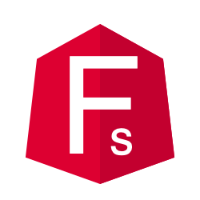

# @fullerstack/ngx-jwt 

**A simple JWT library for Angular applications**

[![status-image]][status-link]
[![version-image]][version-link]
[![coverage-image]][coverage-link]
[![download-image]][download-link]

# Overview

## Description

This library helps with verification and payload extraction of JWT tokens

**@fullerstack/ngx-jwt** attempts to streamline the jwt operation of your Angular application, while promoting DRY **DRY**.

# How to install

    npm i @fullerstack/ngx-jwt |OR| yarn add @fullerstack/ngx-jwt

# How to use

```typescript
// In your environment{prod,staging}.ts

import { ApplicationConfig } from '@fullerstack/ngx-config';
import { LogLevels } from '@fullerstack/ngx-logger';

export const environment: ApplicationConfig = {
  // app name
  appName: '@fullerstack/ngx-jwt',
  // production, staging or development
  production: false,
  log: {
    // log level (application-wide)
    level: LogLevels.debug,
  },
  jwt: {
    // estimate time of http request between client -> server (greater than zero)
    networkDelay: 1,
    // backend may honor expired request arrive `x` seconds after expiry
    expiryLeeway: 5,
  },
};
```

```typescript
// In your app.module.ts

import { ConfigModule } from '@fullerstack/ngx-config';
import { LoggerModule } from '@fullerstack/ngx-logger';
import { JwtModule } from '@fullerstack/ngx-jwt';

import { environment } from '../environments/environment';

@NgModule({
  declarations: [AppComponent],
  imports: [
    BrowserModule,
    ConfigModule.forRoot(environment), // make the environment injectable
    LoggerModule,
    JwtModule,
  ],
  bootstrap: [AppComponent],
})
export class AppModule {}
```

```typescript
// In your app.module.ts

import { Component } from '@angular/core';
import { ConfigService } from '@fullerstack/ngx-config';
import { LoggerService } from '@fullerstack/ngx-logger';
import { JwtService } from '@fullerstack/ngx-jwt';

@Component({
  selector: 'fullerstack-root',
  template: `<h1>Welcome to {{ title }}!</h1>`,
})
export class AppComponent {
  title = 'Fullerstack';
  options = {};
  constructor(
    readonly config: ConfigService,
    readonly logger: LoggerService,
    readonly jwt: JwtService
  ) {
    this.title = this.config.options.appName;

    this.logger.info('AppComponent loaded ...');

    const someToken = 'some-jwt-token-received-from-server'; // <part-1>.<part-2>.<part-2>
    const payload = this.jwt.getPayload(someToken);
    const isExpired = this.jwt.isExpired(payload);
    if (!isExpired) {
      const userId = payload.sub;
      const nextRefresh = this.jwt.getRefreshTime(payload);
      setTimeout(() => {
        // connect to the server to get a new token
      }, nextRefresh * 1000);
    }
  }
}
```

# License

Released under a ([MIT](https://raw.githubusercontent.com/neekware/fullerstack/main/LICENSE)) license.

# Version

X.Y.Z Version

    `MAJOR` version -- making incompatible API changes
    `MINOR` version -- adding functionality in a backwards-compatible manner
    `PATCH` version -- making backwards-compatible bug fixes

[status-image]: https://github.com/neekware/fullerstack/actions/workflows/ci.yml/badge.svg
[status-link]: https://github.com/neekware/fullerstack/actions/workflows/ci.yml
[version-image]: https://img.shields.io/npm/v/@fullerstack/ngx-jwt.svg
[version-link]: https://www.npmjs.com/package/@fullerstack/ngx-jwt
[coverage-image]: https://coveralls.io/repos/neekware/fullerstack/badge.svg
[coverage-link]: https://coveralls.io/r/neekware/fullerstack
[download-image]: https://img.shields.io/npm/dm/@fullerstack/ngx-jwt.svg
[download-link]: https://www.npmjs.com/package/@fullerstack/ngx-jwt
